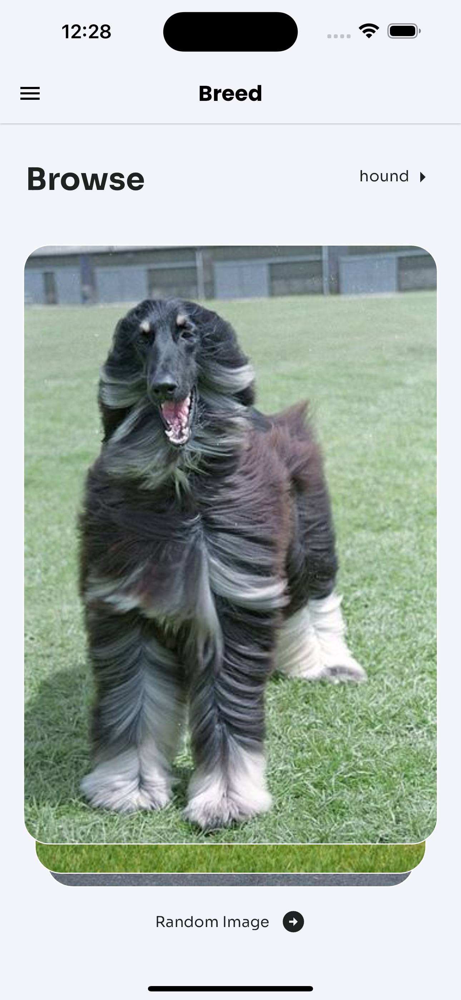
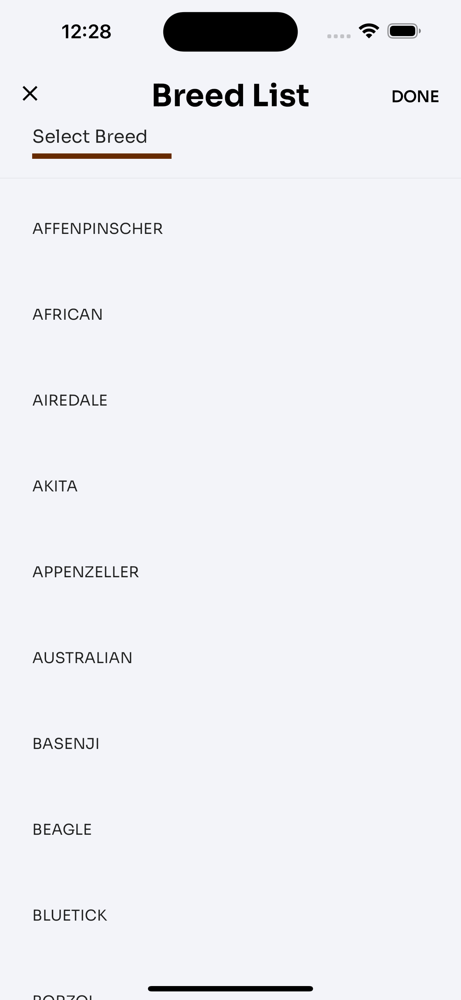
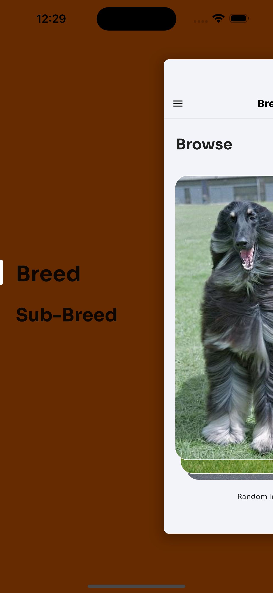
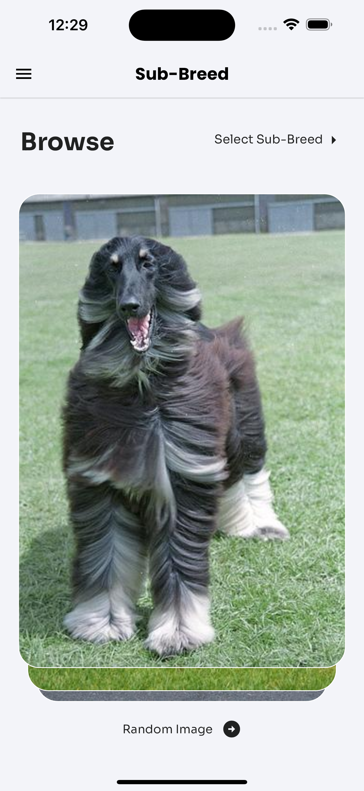
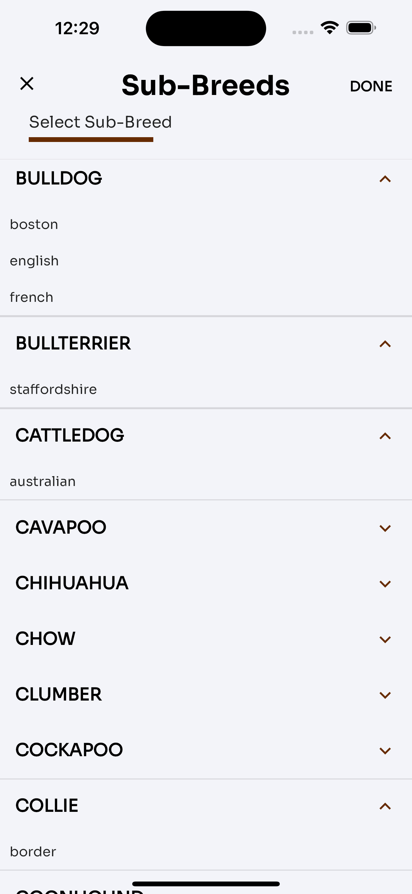
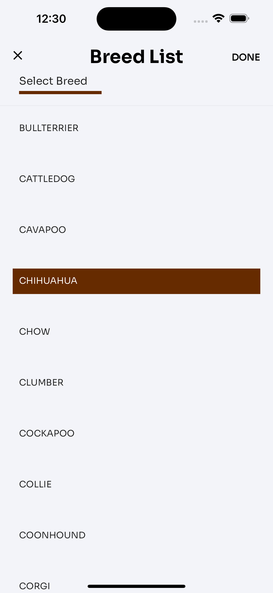
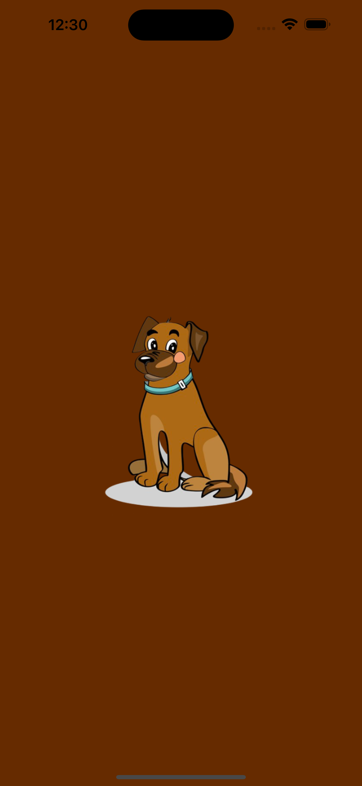
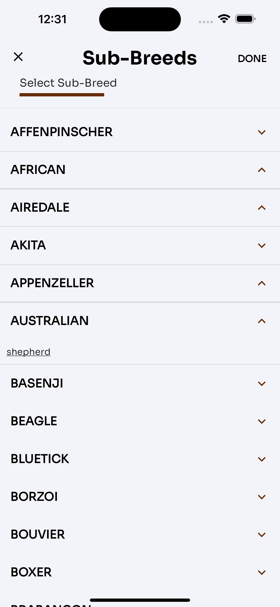

# 🔥🔥 Doggy App  

An App to showcase images of dog breeds and sub-breed

Star⭐ the repo if you like what you see😉.

## ✨ Requirements

* Any Operating System (ie. MacOS X, Linux, Windows)
* Any IDE with Flutter SDK installed (ie. IntelliJ, Android Studio, VSCode etc)
* A little knowledge of Dart and Flutter
* A brain to think 🤓🤓

## Features

* Random images by Breed
* Images list by Breed
* Random image by Breed and Sub-Breed
* Images list by breed and sub breed

## Screenshots

 
 
 
 

## Installation

#### 1. [Setup Flutter](https://flutter.dev/docs/get-started/install)

#### 2. Clone the repo

#### 3. Run `flutter pub get`

## 🤓 Author(s)

**Charly Keleb
CharlyKeleb** 
